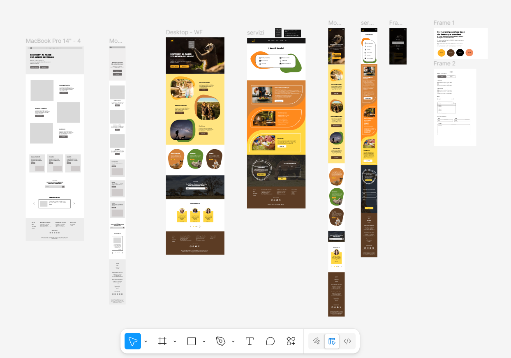

# Portfolio di Amanda Carpenedo

Benvenuti nel repository del mio portfolio personale. Questo progetto è stato creato per mostrare le mie capacità come sviluppatrice front-end, i miei progetti e il mio percorso professionale.

## Riguardo il Progetto

Questo sito è un portfolio digitale che evidenzia la mia esperienza, la mia formazione e i progetti a cui ho lavorato. È stato sviluppato con l'obiettivo di essere un'applicazione a pagina singola (SPA) moderna, reattiva e performante.

## Tecnologie Utilizzate

Questo progetto è stato costruito con o strumento di vibe coding 'Lovable', utilizzando un insieme di moderne tecnologie di sviluppo web:

*   **Framework Principale:** [React](https://react.dev/)
*   **Bundler/Build Tool:** [Vite](https://vitejs.dev/)
*   **Linguaggio:** [TypeScript](https://www.typescriptlang.org/)
*   **Stilizzazione:**
    *   [Tailwind CSS](https://tailwindcss.com/): Un framework CSS utility-first per una stilizzazione rapida e personalizzabile.
    *   [shadcn/ui](https://ui.shadcn.com/): Una collezione di componenti UI riutilizzabili.
*   **Routing:** [React Router](https://reactrouter.com/)
*   **Test:** [Vitest](https://vitest.dev/) per test unitari e di componenti.
*   **Linting:** [ESLint](https://eslint.org/) per garantire la qualità e la coerenza del codice.

Altre librerie importanti includono:

*   `framer-motion` per le animazioni.
*   `lucide-react` per le icone.
*   `react-hook-form` e `zod` per la gestione e la validazione dei moduli.

## Progetti in Evidenza

*(Questa sezione può essere compilata con le descrizioni dei tuoi progetti, come quelli che ho visto nella cartella `src/img`)*

*   Progetto 1 <video src="./src/img/nayane.mp4" width="500" controls></video> 


*   Progetto 2 <video src="./src/img/git-hub.mp4" width="500" controls></video>


*   Progetto 3 <video src="./src/img/syntaxwear.mp4" width="500" controls></video>


*   Progetto 4 
* 

## Come Eseguire il Progetto Localmente

1.  **Clonare il repository:**
    ```bash
    git clone https://github.com/amanda-carpenedo/creative-coder-portfolio.git
    ```

2.  **Navigare nella directory del progetto:**
    ```bash
    cd creative-coder-portfolio
    ```

3.  **Installare le dipendenze:**
    ```bash
    npm install
    ```

4.  **Avviare il server di sviluppo:**
    ```bash
    npm run dev
    ```

    Aprire [http://localhost:8080](http://localhost:8080) per vedere il progetto nel tuo browser.

## Contatti

*   **LinkedIn:** https://www.linkedin.com/in/amandacarpenedo/
*   **Email:** amanda_carpenedo@hotmail.com